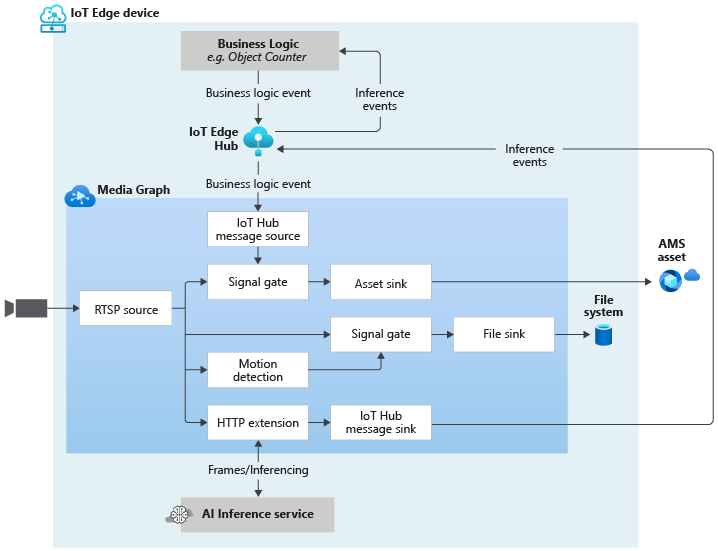

# Event-based video recording to Assets based on specific objects being detected by external inference engine and to the Edge device based on motion being detected

This topology enables you use to an object detection AI model to look for objects in the video and record video clips to Assets in the cloud only when a certain type of object is detected. The trigger to generate these clips is based on the AI inference events published onto the IoT Hub. The video from an RTSP-capable camera is also analyzed for the presence of motion. When motion is detected, events are sent to a signal gate processor node which opens, sending frames to a file sink node. As a result, new files (MP4 format) are created on the local file system of the Edge device, containing the frames where motion was detectedYou can read more about how to use this topology in [this](https://docs.microsoft.com/azure/media-services/live-video-analytics-edge/2-signal-gate-tutorial) tutorial.
 

  

 

