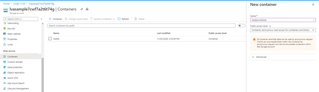
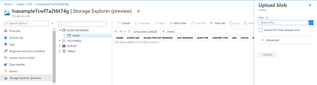
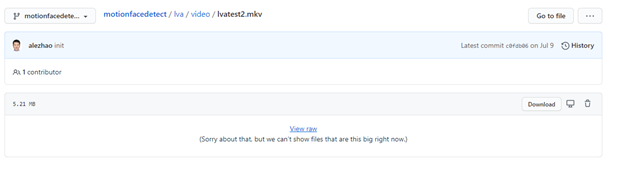

# Copying your own videos into a folder for RTSPsim

[Binding](https://docs.microsoft.com/en-us/azure/iot-edge/how-to-access-host-storage-from-module?view=iotedge-2018-06) is a method used to link module storage to device storage. This method is typically used by the RTSPSim module for access to the video file that is going be live streamed.

First, upload your video to a public blob container in an Azure Storage Account **OR** Upload your video to GitHub

## For Azure Storage Account

In the Azure Portal, navigate to your **storage account** from your resource group

Under the **Containers** blade, click **+ Container** to create a new container.
Name the new container and set the Public access level to **Container (anonymous read access for containers and blobs)**
<br>
<p align="center">
  
</p>
<br>

Under the **Storage Explorer (preview)** blade, navigate to your newly created container under **BLOB CONTAINERS** and upload your video file (ensure that your video file format is supported by Live555, Ex: .mkv)
<br>
<p align="center">
  
</p>
<br>

With your video file selected and highlighted, select **Copy URL**

## For GitHub
After uploading your video file:
* Select your video file
* Right-click on **View raw**
* Select **Copy link address**

<br>
<p align="center">
  
</p>
<br>

## On IoT Edge Deivce (Ex: Azure Linux VM)
* Run **cd samples/input** (if you do not already have this directory, create a “samples” directory, then create an “input” directory inside of the “samples” directory)
* Run **wget < copied URL >**

The video file should now be in the **samples/input** directory
* Run **ls -lta** to ensure that the video exists and has the correct file size

In the deployment manifest, the **samples/input** directory is binded to the **live/mediaServer/media** directory (**$INPUT_VIDEO_FOLDER_ON_DEVICE** is set to **samples/input** by default in the .env file)
```JSON
"rtspsim": {
            "version": "1.0",
            "type": "docker",
            "status": "running",
            "restartPolicy": "always",
            "settings": {
              "image": "mcr.microsoft.com/lva-utilities/rtspsim-live555:1.2",
              "createOptions": {
                "HostConfig": {
                  "Binds": [
                    "$INPUT_VIDEO_FOLDER_ON_DEVICE:/live/mediaServer/media"
                  ]
                }
              }
            }
```
**live/mediaServer/media** is the directory used by RTSPSim

**Port 554** is exposed for RTSPSim, therefore the RTSP URL is as follows:
**rtsp://rtspsim:554/media/< video file name >**

The directory and port configurations are done by the RTSPSim image in the RTSPSim module 

